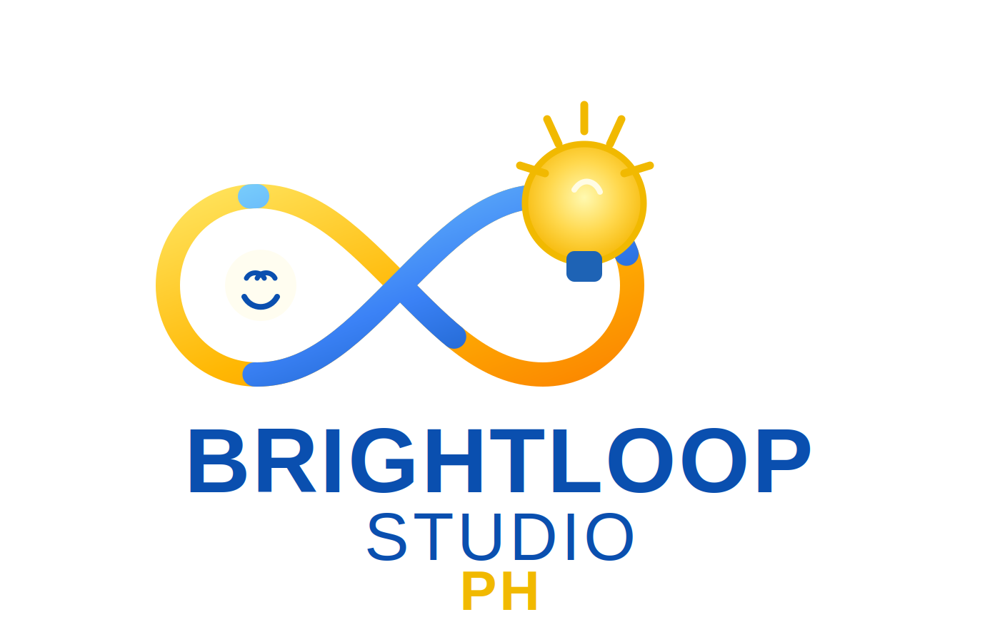

# 🚀 Creator Growth Control Plane



**Creator Growth Control Plane** is a high-performance, production-ready automation engine and observability dashboard designed to hyper-scale content creation, cold outreach, and affiliate marketing operations. 

Built with a robust microservices architecture, this monorepo unifies your existing scripts into one seamless, controllable, and observable system. Whether you are orchestrating localized LLMs to write YouTube shorts, or running headless browsers to scrape leads, the Control Plane gives you God-mode over your automated empire.

### 🛠️ Tech Stack
- **Frontend:** Next.js (App Router), React, TypeScript, server-side rendering
- **Orchestrator API:** ASP.NET Core (.NET 10), Entity Framework Core
- **Workers:** Python, Selenium, Undetected Chromedriver
- **AI & LLMs:** OpenAI, Google Gemini, Ollama (Local support)
- **Databases:** PostgreSQL (Relational schema), MongoDB (Document storage)
- **Message Broker:** Redis Stack (Pub/Sub & Queueing)
- **Infrastructure:** Docker, Docker Compose, Nx workspace

### 🌟 Sample Brand Channels:
- YouTube: `@brightloopstudioph`
- X: `@BrightLoopPh`

## Ready Functionality

- Next.js monitoring dashboard with modules for:
  - Dashboard KPIs
  - Jobs live monitor
  - Accounts
  - Content
  - Outreach
  - Affiliate
- Real-time jobs stream from the API (SSE) with:
  - live status changes
  - progress and ETA
  - timeline events
  - scrape traces
  - email attempt visibility (sent/failed/skipped + message previews)
- Job Inspector dialog UX for deep drilldown without cluttering the main jobs table.
- Backend controls in the Jobs page:
  - Run smoke test
  - Run outreach dry-run
  - Run outreach live
  - Run Twitter post
  - Run YouTube upload
  - Run affiliate pitch
  - Stop selected job
- ASP.NET Core orchestrator with:
  - job queueing endpoints
  - status/event ingestion endpoints
  - dashboard read-model endpoints
  - health endpoint for Postgres, Redis, and MongoDB
- Desktop Python worker:
  - Redis queue consumer
  - execution bridge to legacy automation flows
  - structured event streaming back into the orchestrator
- Shared infra stack (`tech-infra`) using latest images:
  - Postgres
  - Redis Stack (vector/search/json support)
  - MongoDB
- Project stack separated from shared infra:
  - web container
  - API container
  - dedicated app network
- Desktop helper scripts for setup, preflight, run, smoke testing, and hybrid startup.

## Architecture

- Web UI: `apps/web` (Next.js + TypeScript)
- API / orchestrator: `apps/api` (ASP.NET Core)
- Worker: `workers/python-worker` (Python)
- Shared infra: `infra/docker-compose.yml`
- Project services: `docker-compose.project.yml`

## Local Quick Start

```powershell
powershell -ExecutionPolicy Bypass -File scripts/setup_local.ps1
powershell -ExecutionPolicy Bypass -File scripts/start_stack.ps1
npm.cmd run start:project
npm.cmd run dev:worker
```

Open:
- Web: `http://localhost:3000`
- API: `http://localhost:5050`

## Key Scripts

- `scripts/setup_local.ps1`: bootstrap Python/Node/.NET dependencies
- `scripts/start_stack.ps1`: start shared `tech-infra`
- `scripts/start_project_stack.ps1`: build/start API + web containers
- `scripts/run_worker.ps1`: run desktop worker
- `scripts/smoke_test_stack.ps1`: queue + verify smoke test
- `scripts/run_outreach_dry_run.ps1`: run outreach dry workflow
- `scripts/run_outreach_live.ps1`: run outreach live workflow

## Environment

Primary worker/orchestration environment variables:
- `CGCP_API_BASE_URL`
- `CGCP_REDIS_URL`
- `CGCP_QUEUE_NAME`
- `CGCP_OUTREACH_DRY_RUN`
- `CGCP_OUTREACH_NICHES`
- `CGCP_OUTREACH_TIMEOUT`
- `CGCP_OUTREACH_DEPTH`
- `CGCP_OUTREACH_CONCURRENCY`
- `CGCP_OUTREACH_EXIT_ON_INACTIVITY`
- `CGCP_OUTREACH_MAX_EMAILS`

Use `config.example.json` as baseline and keep real credentials local only.

## Credits

This project includes and extends legacy workflow foundations from the open-source [MoneyPrinterV2](https://github.com/FujiwaraChoki/MoneyPrinterV2) project.  
Credits to the original maintainers and contributors for the early automation groundwork.

## License

AGPL-3.0. See [LICENSE](LICENSE).
